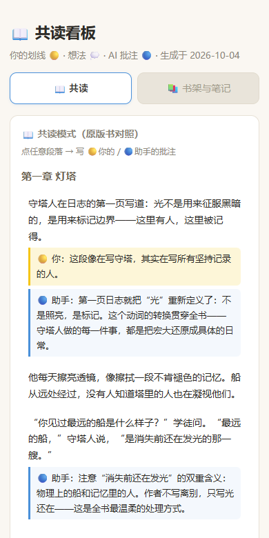
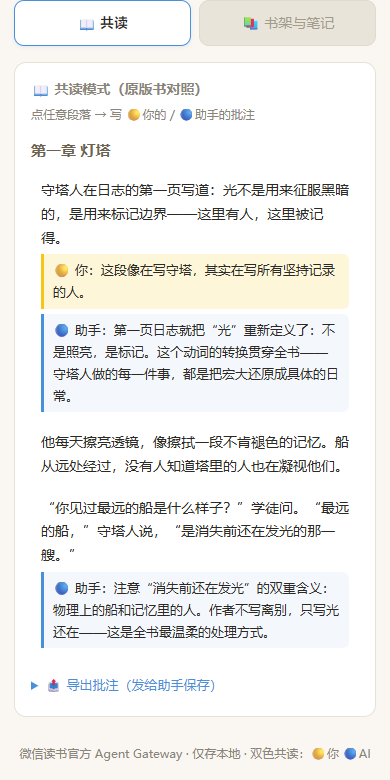
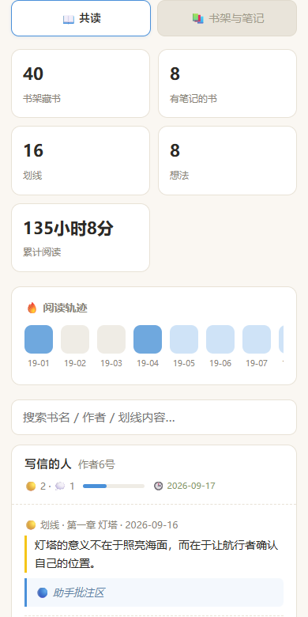

# 和 AI 一起读一本书：微信读书 × 共读看板搭建教程

> 人和 AI 读同一本书，两种颜色的批注留在同一段旁边。
> 🟡 你划的线、写的想法 —— 🔵 AI 的回应与解读，并排长在同一个页面上。

> 🖼️ 本文引用的截图在仓库 `screenshots/` 文件夹，全部由**虚构演示数据**渲染（见 [PRIVACY.md](PRIVACY.md)）。



## 这是什么

一套**零依赖、纯本地**的共读系统：

```
微信读书（你的划线/想法，云端真实数据）
        ↓  官方 Agent Gateway（wrk- key）
① weread_pull.py        拉书架 / 阅读统计 / 划线 / 想法 → JSON
② epub_split.py         你发的原版 EPUB → 按段落拆进 SQLite
③ weread_dashboard.py   生成单文件 HTML 看板
        ↓
📱 手机浏览器打开：共读页（逐段双色批注）+ 书架页（搜索你的全部笔记）
        ↓
批注 JSON 发回给 AI 持久化 → 重新生成 → 批注永久留在书页边
```

**特点**：

- **官方接口**：走微信读书 2026-05 发布的 Agent Skill（个人 API Key），非 cookie 抓取，不怕封
- **零依赖**：三个脚本只用 Python 标准库，手机沙箱 / 电脑 / 服务器直接跑
- **单文件看板**：一个 HTML 双击就开，无需服务器，手机适配
- **双色共读**：借鉴 Coread 项目的设计——人与 AI 的批注并排留在同一段落

效果预览：

| 共读页（默认首页） | 书架页（你的全部笔记） |
|---|---|
|  |  |

---

## 一、准备工作

### 1. 申请微信读书 API Key（免费）

1. 手机微信读书 App 扫码访问：**https://weread.qq.com/r/weread-skills**
2. 按页面提示开通，得到一个 `wrk-` 开头的 Key
3. 把 Key 单独存成一个文本文件（如 `wxds.txt`），**不要提交到任何仓库 / 群聊**

> 🔒 Key 绑定你的读书账号身份。本教程所有脚本只从本地文件读 Key，不打印、不写入输出。

### 2. 环境

- Python 3.8+（手机沙箱、Termux、电脑都行）
- 无需 pip install 任何东西

---

## 二、三个脚本

> 完整代码在文末「获取方式」。目录结构：

```
weread/
├── weread_pull.py        # ① 拉数据
├── epub_split.py         # ② EPUB 拆段
├── weread_dashboard.py   # ③ 生成看板
└── wxds.txt              # 你的 Key（wrk-xxx 一行）
```

### ① 拉取数据

```bash
python3 weread_pull.py wxds.txt weread-data
```

拉取内容：

| 数据 | 用途 |
|------|------|
| 书架 `/shelf/sync` | 总览 |
| 阅读统计 `/readdata/detail` | 年度阅读轨迹热力格 |
| 笔记本 `/user/notebooks` | 哪些书有笔记 + 最近笔记时间（排序用） |
| 每本书划线 `/book/bookmarklist` | 🟡 划线全文 |
| 每本书想法 `/review/list/mine` | 💭 你的点评 |

跑完得到 `weread-data/` 下 4 个 JSON。

### ② 拆原版书（共读模式的关键）

**微信读书 API 不提供正文**——要"逐段共读"，需要原版书文件。找一本 EPUB（你自己合法拥有的），发给 AI 或自己跑：

```bash
python3 epub_split.py 你的书.epub weread-data
```

它用 zipfile 直接解 EPUB，把每章切成段落存进 `segments.db`（SQLite），同时生成章节索引 `book.json`。

### ③ 生成看板

```bash
python3 weread_dashboard.py weread-data weread-data/dashboard.html
```

输出**一个自包含 HTML**：样式、脚本、数据全部内联。发到手机（微信文件传输助手 / 网盘都行），浏览器直接打开。

---

## 三、看板怎么用

### 📖 共读页（默认首页）

- 全书段落按章排列，**点任意段落**弹出批注框
- 上面一栏写 🟡 你的想法，下面一栏写 🔵 AI 的批注
- 保存后批注立刻显示在段落下方，双色并排
- 底部「📤 导出批注」→ 复制 JSON 发给 AI → 写回 `weread-data/coread-notes.json` → 重新生成看板，批注永久保留

### 📚 书架页

- KPI 总览 + 历年阅读轨迹格（**截图中的书名、数量、时长均为演示用的虚构数据**，你的看板显示的是你的真实账号数据）
- 有笔记的书按**最近读**排序，带进度条和日期
- 实时搜索：书名 / 作者 / 划线原文，输入即过滤
- 点书名展开你的划线和想法，每条下面预留 🔵 批注位

### 共读的实际工作流

```
你：我读到第二章了，这段"忽必烈三连问"什么意思？
AI：（逐段解读，把批注写进 coread-notes.json，重新生成看板）
你：（手机打开新看板，在书页边看到 🔵 回复，点同一段落写 🟡 回应）
……书越来越厚，笔记越攒越多
```

---

## 四、放在手机 Agent 上跑（可选）

iPhone / Android 上有沙箱 Agent（能跑 Python、读写文件）的话，把三个脚本 + Key 文件交给它，照着跑上面三条命令即可。之后每次"更新数据 / 换书 / 加批注"都是一句话的事。

让 Agent 遵守三条规矩：

1. **Key 只从文件读**，不打印、不写进任何输出
2. 生成看板后**给你文件路径**（或直接发文件）
3. 你发的批注 JSON 写回 `coread-notes.json` 时**合并不覆盖**

---

## 五、设计与致谢

本项目的共读形态，站在这些开源项目的肩膀上：

| 项目 | 借鉴了什么 | 协议 |
|------|-----------|------|
| [Coread 共读室](https://github.com/meowmana/coread) | 核心设计：人与 AI 共享同一本书的页码、划线、批注并排显示，AI 通过接口批注 | MIT |
| [Tasogare 黄昏](https://github.com/EnhydrInk/tasogare) | 双色划线意象：两种笔迹留在同一页 | MIT |
| [awesome-weread](https://github.com/BENZEMA216/awesome-weread) | 官方 Skill 生态索引（CC0），本文接口清单据此整理 | CC0 |
| [微信读书官方 Agent Skill](https://weread.qq.com/r/weread-skills) | 数据来源：官方网关与 API Key 机制 | 官方服务 |

> 本教程的三个脚本为原创实现，仅调用上述官方公开接口，未复制任何上述项目的源码。

视觉风格：暖纸色 + 划线黄 + 助手蓝，向"纸质书页边批注"致敬。

---

## 六、常见问题

**Q：会泄露我的读书数据吗？**
所有数据只存在你本地（JSON / SQLite / HTML），Key 只在本地使用。看板 HTML 里不含 Key。**但请注意**：生成的 HTML 包含你的划线和想法全文，分享前自己掂量。（本文截图全部来自一套**虚构演示数据**，非作者真实读书记录。）

**Q：接口报错 / 提示 upgrade_info？**
官方在 Skill 里约定：返回 `upgrade_info` 时需按提示升级 `skill_version` 常量（脚本顶部一处）。errcode 401 = Key 失效，重新扫码申请。

**Q：为什么必须发原版书？**
API 只给笔记和章节目录，不给正文。网络搜原文不可靠，EPUB 拆段是唯一准确的逐段对齐方式。

**Q：个人文档（自己上传的书）的笔记能同步吗？**
微信读书的划线/想法只要是在微信读书 App 里做的，就同步云端，API 能拉到。（这点比 Kindle 强——Kindle 的个人文档标注不上云端。）

**Q：批注写多了会卡吗？**
单文件 HTML 承载几百段 + 批注没问题。整本书几万段的话，建议 `epub_split.py` 按需只拆当前读的几章（脚本已支持传入后自行筛选）。
## 七、仓库文件

三个脚本均为**原创实现**（纯 Python 标准库，无第三方依赖），就在本仓库：

```
├── README.md              ← 本文
├── weread_pull.py         ← 脚本① 拉取数据（118 行）
├── epub_split.py          ← 脚本② EPUB 拆段（73 行）
├── weread_dashboard.py    ← 脚本③ 生成看板
├── make_share_demo.py     ← 生成虚构演示数据（复现截图用）
├── screenshots/           ← 演示截图（虚构数据）
├── PRIVACY.md             ← 隐私与数据说明
└── LICENSE                ← MIT
```

> 脚本短小、注释齐全：想改交互、加功能，直接让 AI 读着改即可——这也是本教程的用法之一。

---

*生成于 2026-10 · 用微信读书官方 Agent Gateway · 数据仅存本地 · MIT License*